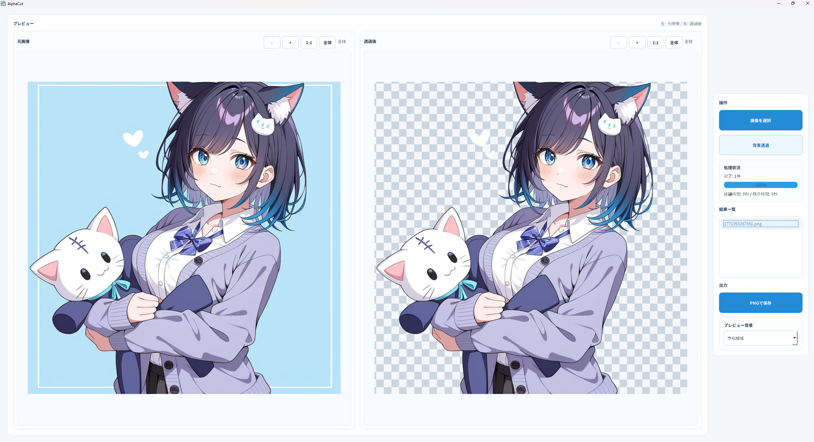

# AlphaCut

AlphaCutは、AIモデルを使用して画像の背景を透過させ、PNGとして保存できるソフトです。

## 最低スペック

- OS: Windows 10 / 11 64bit
- CPU: 4コア以上の64bit CPU
- メモリ: 16GB以上
- 空き容量: 10GB以上
- GPU: なしでも動作可能。ただし、NVIDIA GPUとCUDA対応環境がある場合は処理が高速になります。
- ネットワーク: 初回実行時のAIモデル取得にインターネット接続が必要です。

## 注意
- イラストの背景を切り抜くことを目的として作成されました。イラスト以外の画像に対しては、正確な切り抜きができない可能性があります。
- ローカルでAIモデルを使用して処理を行うため、インターネットにアップロードされることはありません。
